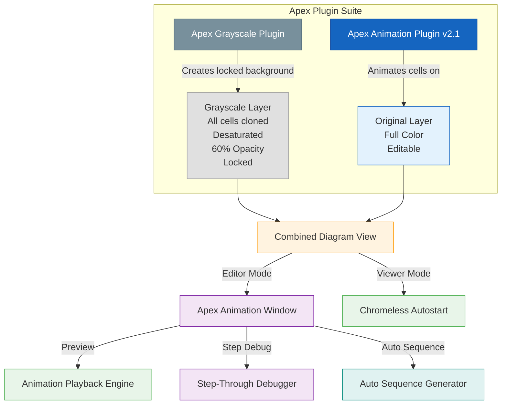
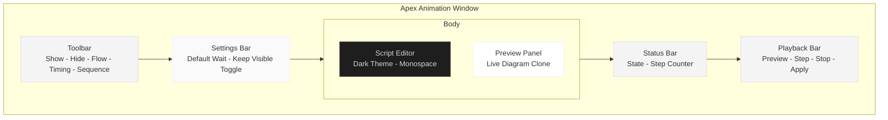
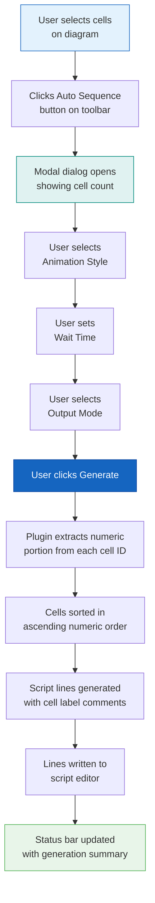
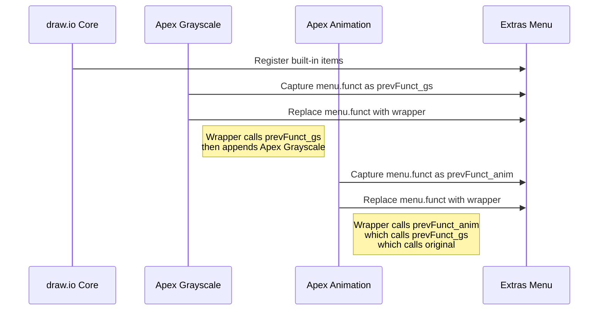
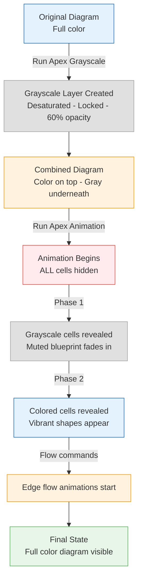
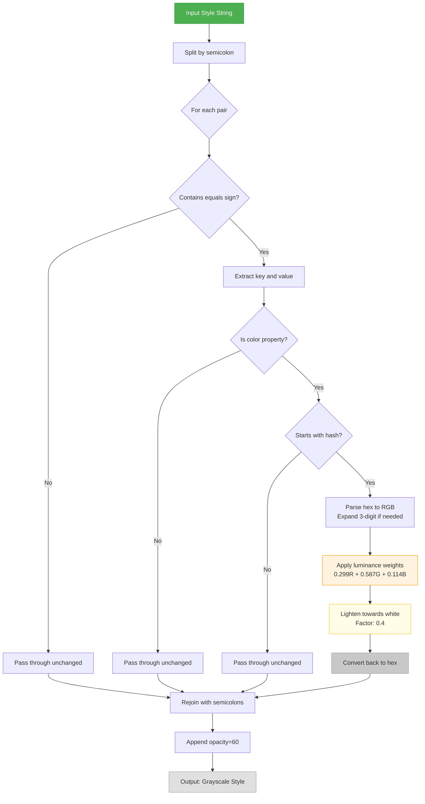
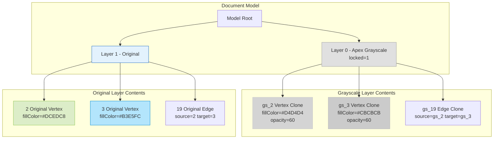
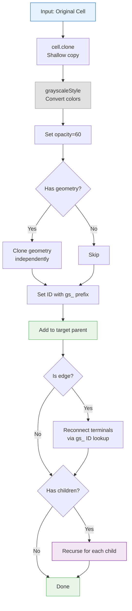
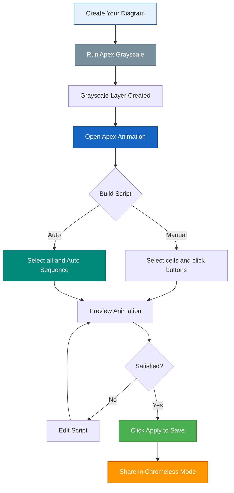
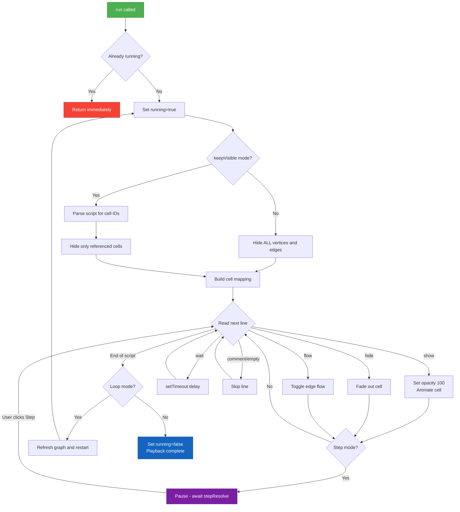

# Apex Draw.io Plugins

> A suite of draw.io plugins for creating professional step-by-step diagram animations with grayscale background layers. Built upon the original Animation plugin by JGraph / draw.io AG and extended with a redesigned interface, new automation features, debugging tools, and a companion grayscale layer generator.


---

## Table of Contents

- [Overview](#overview)
- [Architecture](#architecture)
- [Original Animation Plugin](#original-animation-plugin)
- [Apex Animation Plugin - New Features](#apex-animation-plugin---new-features)
- [Apex Grayscale Plugin](#apex-grayscale-plugin)
- [Script Syntax Reference](#script-syntax-reference)
- [Installation](#installation)
- [Usage Guide](#usage-guide)
- [Technical Deep Dives](#technical-deep-dives)
- [Compatibility](#compatibility)
- [File Structure](#file-structure)
- [Contributing](#contributing)
- [License](#license)
- [Acknowledgments](#acknowledgments)

---

## Overview

Apex Draw.io Plugins consists of two complementary plugins designed to bring diagrams to life with scripted, step-by-step animations.

The project began as a fork of the original **Animation plugin** bundled with draw.io, created by **JGraph Holdings Ltd** and **draw.io AG** (Copyright 2020-2025). That plugin provided a foundational scripting engine for revealing diagram cells through show, hide, flow, and wait commands. It included a basic HTML table layout with a textarea for script editing, a preview panel, and chromeless autostart support.

The **Apex Animation Plugin (v2.1)** is a complete redesign and feature expansion of that original work. It preserves full backward compatibility with existing animation scripts while introducing a modern styled UI, an Auto Sequence generator, step-through debugging, a settings panel, comment support, and numerous quality-of-life improvements.

The **Apex Grayscale Plugin** is an entirely new companion tool created by Joseph McMullin of Apex Development Studio. It creates a locked, muted grayscale copy of your entire diagram on a layer beneath the originals. This provides a static "blueprint" backdrop so that when the Apex Animation plugin progressively reveals colored elements on top, viewers always have full spatial context of the complete diagram.

Together, these plugins enable a powerful presentation workflow: generate the grayscale background, script the animation sequence, preview it, and share the diagram in chromeless mode where it auto-plays with looping.

---

## Architecture



---

## Original Animation Plugin

### Attribution

The original Animation plugin was created by **JGraph Holdings Ltd** and **draw.io AG**, copyright 2020-2025. It is distributed as part of the draw.io open-source diagramming platform. The original source code served as the foundation for the Apex Animation Plugin and its scripting engine, cell mapping logic, edge flow animation, and chromeless autostart behavior are preserved and credited to the original authors.

- **Original Authors:** JGraph Holdings Ltd, draw.io AG
- **Original Copyright:** 2020-2025
- **Source Repository:** [github.com/jgraph/drawio](https://github.com/jgraph/drawio)

### Original Feature Set

The original Animation plugin provided the following capabilities that form the foundation of the Apex Animation Plugin:

- **Script-based animation engine** that reads a newline-delimited list of commands and executes them sequentially against a cloned preview graph. Each line is parsed into tokens and dispatched to the appropriate handler. This core loop architecture is preserved in the Apex version.

- **`show` command** that reveals a hidden cell by setting its opacity to 100 and removing the `noLabel` flag. The original supported two animation modes: a default wipe-in animation (using `graph.executeAnimations` with `createWipeAnimations`) and an optional `fade` mode (using `Graph.fadeNodes` to transition opacity from 0 to 1). Both modes are fully preserved.

- **`hide` command** that fades out a visible cell by calling `Graph.fadeNodes` with opacity transitioning from 1 to 0. This provides a smooth disappearance effect for cells that need to be removed during an animation sequence.

- **`flow` command** that toggles a dashed "marching ants" animation on edge paths. The original implementation adds the CSS class `mxEdgeFlow` to the second SVG path element of an edge's shape node and sets `stroke-dasharray` to 8 if the edge is not already dashed. It supported `start`, `stop`, and toggle (no argument) modes.

- **`wait` command** that pauses script execution for a specified number of milliseconds using `setTimeout`. This is the primary mechanism for controlling timing between animation steps.

- **Cell mapping system** (`mapCell` function) that creates a lookup table between cells in the original diagram and their clones in the preview graph. This recursive function walks the entire cell hierarchy and maps each cell by its ID, enabling the script to reference original cell IDs while operating on the cloned preview graph.

- **Preview graph** that clones the entire diagram model into a separate `Graph` instance rendered inside the animation window. The preview graph is non-interactive (disabled), supports panning via left-button drag, and auto-fits to the preview container. This allows users to see the animation without modifying the actual diagram.

- **Global hide phase** that runs before animation playback begins. The engine iterates over all cells in the preview graph's model and sets opacity to 0 and `noLabel` to 1 on every vertex and edge. This ensures all cells start hidden and are only revealed by explicit `show` commands in the script.

- **Toolbar buttons** for the seven core actions: Fade In (`show CELL fade`), Wipe In (`show CELL`), Fade Out (`hide CELL`), Flow On (`flow CELL start`), Flow Off (`flow CELL stop`), Flow Toggle (`flow CELL`), and Wait (`wait 1000`). Clicking a button with cells selected on the main diagram appends the corresponding command(s) to the script textarea. The Wait button was appended automatically after cell-targeted commands.

- **Script textarea** for direct editing of the animation script. The textarea occupies the left column of an HTML table layout and allows free-form text editing of commands.

- **Preview, Stop, and Apply buttons** at the bottom of the window. Preview clones the current diagram into the preview graph and runs the script. Stop clears the preview graph and halts execution. Apply writes the script text to the diagram root's `animation` attribute, persisting it in the `.drawio` file.

- **Chromeless autostart** that detects when draw.io is running in viewer/embed mode (`isChromelessView`). If the diagram root has an `animation` attribute, the plugin automatically begins playing the animation in a loop. If the animation data is not yet available (file still loading), it registers a `fileLoaded` listener to start once the file is ready.

- **Auto-save on page switch** that listens for `mxEvent.ROOT` changes on the editor graph. When the user navigates to a different page in a multi-page diagram, the plugin saves the current script to the old page's root and loads the script from the new page's root. This ensures each page can have its own independent animation script.

- **Edge flow CSS injection** that creates a `<style>` element with the `mxEdgeFlow` animation keyframes. The animation moves `stroke-dashoffset` from 0 to -16 over 0.5 seconds with linear easing and infinite iteration, producing the "marching ants" effect on edges.

- **HTML table layout** with a two-column, two-row structure: the script textarea in the top-left cell (140px wide), the preview container in the top-right cell, and all buttons in a single bottom row spanning both columns. The window was created as an `mxWindow` instance at 640x480 pixels with resize and close support.

- **Loop support** in chromeless mode where, upon reaching the end of the script, the engine refreshes the preview graph and restarts the `run` function, creating an infinite loop of the animation.

### Original Script Syntax

| Command | Description |
|---------|-------------|
| `show <cellId>` | Wipe-in reveal of a cell |
| `show <cellId> fade` | Fade-in reveal of a cell |
| `hide <cellId>` | Fade-out a cell |
| `flow <cellId> [start\|stop]` | Toggle/start/stop edge flow animation |
| `wait <milliseconds>` | Pause execution |

---

## Apex Animation Plugin - New Features

The Apex Animation Plugin v2.1 introduces the following new features and improvements on top of the original plugin's foundation. All original functionality is preserved with full backward compatibility - existing animation scripts work without modification.

### Redesigned User Interface

The original HTML table layout with unstyled native buttons has been completely replaced with a modern, responsive flexbox-based interface. The new UI uses a custom CSS stylesheet injected at plugin load time, providing a polished look that is consistent across operating systems and browsers.

The window has been enlarged from 640x480 to 780x560 pixels by default and now supports maximization in addition to the existing resize and close capabilities. The entire layout is built with semantic CSS class names prefixed with `apex-` to avoid conflicts with draw.io's own styles.



### Color-Coded Grouped Toolbar Buttons

The flat row of unstyled buttons has been replaced with logically grouped, color-coded button clusters. Each group has a small uppercase label and distinct border/text colors so users can quickly identify the action category at a glance.

| Group | Color Scheme | Buttons |
|-------|-------------|---------|
| **Show** | Blue (#2196F3) | Fade In, Wipe In |
| **Hide** | Red (#f44336) | Fade Out |
| **Flow** | Orange (#FF9800) | On, Off, Toggle |
| **Timing** | Gray (#9E9E9E) | + Wait |
| **Sequence** | Teal (#00897B) | Auto Sequence |
| **Playback** | Mixed | Preview (green), Step (purple), Stop (red), Apply (blue) |

All buttons have hover states with lightened background fills for visual feedback.

### Settings Panel

A new settings bar sits between the toolbar and the main body, providing persistent configuration options that affect how commands are generated and how animations are played.

**Default Wait Time (ms):** A numeric input (range 50-10000, step 50) that controls the duration inserted by the "+ Wait" button and appended automatically after cell-targeted commands from the toolbar. The original plugin hardcoded this at 1000ms. Changing this value immediately affects all subsequent button clicks without requiring a page reload.

**Keep Visible Toggle:** A checkbox labeled "Keep diagram visible (animate selected only)." When enabled, the animation engine's initial hide phase only hides cells that are explicitly referenced in `show`, `hide`, or `flow` commands in the script. All other cells remain fully visible. This is useful when you want to animate a subset of a large diagram without the entire diagram disappearing at the start. The original plugin always hid every cell.

### Dark-Themed Script Editor

The script textarea has been restyled with a dark background (`#1e1e1e`), light text (`#d4d4d4`), and a monospaced font stack (SF Mono, Menlo, Consolas, monospace). The line height is set to 1.6 for readability. This provides a code-editor feel that makes it easier to read and edit animation scripts, especially for longer sequences.

The editor also includes placeholder text that serves as inline documentation, showing available commands and basic usage instructions. This disappears as soon as the user begins typing.

### Cell Labels as Script Comments

When adding commands via toolbar buttons, the plugin now automatically looks up the selected cell's label text (using `graph.getLabel`), strips any HTML tags, truncates to 30 characters if necessary, and appends it as a comment after the command. For example, selecting a cell labeled "Database Server" and clicking Fade In produces:

```
show 42 fade  # Database Server
wait 1000
```

This makes scripts significantly more readable, especially in complex diagrams where cell IDs are opaque numbers.

### Comment Support in Scripts

Lines beginning with `#` are now recognized as comments and skipped during playback. The animation engine's `next()` function checks the first character of each trimmed line and advances to the next line without executing anything if it finds a `#`. This allows users to annotate their scripts with section headers, notes, and explanations without affecting playback.

Empty lines are also gracefully skipped, allowing whitespace-based visual grouping of related commands.

### Auto Sequence Generator

This is an entirely new feature with no equivalent in the original plugin. It allows users to select multiple cells on the diagram and generate a complete, ordered animation script in one click.

**How it works:**

1. The user selects one or more cells on the main diagram (including using Ctrl+A to select all).
2. The user clicks the "Auto Sequence" button in the Sequence toolbar group.
3. A styled modal dialog appears showing the number of selected cells and three configuration options.
4. The user configures the animation style, wait time, and output mode.
5. Clicking "Generate" sorts all selected cells by the numeric portion of their ID and writes the corresponding script lines to the editor.

**Dialog options:**

| Option | Values | Description |
|--------|--------|-------------|
| Animation style | Fade In, Wipe In, Fade Out | Determines which command template is used for each cell |
| Wait between cells (ms) | 0-30000, step 50 | Duration of `wait` command inserted after each cell. Set to 0 to skip wait commands entirely |
| Mode | Append, Replace | Append adds to the existing script; Replace clears and overwrites |

**Numeric ID sorting:** The `extractNumber` function handles various ID formats. Pure numeric IDs like `5` are parsed directly. Prefixed IDs like `gs_12` or `cell-3` have their numeric portion extracted via regex. IDs with no numeric component sort to the end. This ensures that cells animate in logical diagram order regardless of the order in which they were selected.



### Step-Through Debug Mode

The original plugin only supported full-speed playback with no way to pause or inspect individual steps. The Apex version adds a step-through debug mode that allows line-by-line execution of the animation script.

**How it works:**

1. Click the Step button when no animation is running. This sets `stepMode = true` and starts the preview.
2. The animation engine hides all cells as usual, then pauses before executing the first non-wait command.
3. The status bar shows "Step mode - click Step to advance" along with the current step number.
4. Each subsequent click of the Step button resolves a Promise that was created when the engine paused, executing the current command and advancing to the next line.
5. `wait` commands execute normally (with their full delay) even in step mode, so you can observe timing behavior.
6. Clicking Stop at any point halts execution, resolves any pending Promise, and clears the preview.

The implementation uses a Promise-based pause mechanism. When step mode is active and a non-wait command is encountered, the engine creates a new Promise and stores its `resolve` function in the `stepResolve` variable. The engine then returns, halting the recursive `next()` chain. When the user clicks Step, `stepResolve()` is called, which triggers the `.then()` handler that executes the command and calls `next()` to continue.

### Status Bar

A new status bar sits at the bottom of the window between the main body and the playback toolbar. It contains two spans: a left-aligned state indicator and a right-aligned step counter.

| State | Left Text | Right Text |
|-------|-----------|------------|
| Idle | "Ready" | (empty) |
| Playing | "Playing..." | "3 / 25" |
| Step mode | "Step mode - click Step to advance" | "7 / 25" |
| Finished | "Finished" | "25 / 25" |
| Stopped | "Stopped" | (preserved) |
| After Apply | "Script saved to diagram" | (preserved) |
| After Auto Sequence | "Auto Sequence: 15 cells generated (fade, 500ms wait)" | (preserved) |

### Auto-Scroll on Edit

When commands are added to the script editor via toolbar buttons or the Auto Sequence generator, the textarea's `scrollTop` property is set to `scrollHeight`, ensuring the most recently added lines are always visible. The original plugin did not scroll the textarea, requiring manual scrolling to see new commands in long scripts.

### Maximizable Window

The `mxWindow` instance is now created with `setMaximizable(true)`, adding a maximize button to the window's title bar. This allows users to expand the animation editor to fill the entire draw.io viewport, which is useful when working with long scripts or wanting a larger preview area. The original window only supported resize and close.

### Refactored Animation Engine

The core animation engine has been refactored for clarity and extensibility while preserving identical behavior.

**`executeCommand` function:** The deeply nested if/else chain inside the `next()` function has been extracted into a standalone `executeCommand(tokens, mapping, graph)` function with a clean switch statement. This makes the code easier to read, test, and extend with new commands in the future.

**`onStep` callback:** The `run()` function now accepts an optional `onStep(currentStep, totalSteps)` callback that is invoked before each command is executed and when playback finishes (with `currentStep = -1`). This enables the UI to update the status bar and step counter without tight coupling between the engine and the interface.

**`keepVisible` parameter:** The `run()` function now accepts a `keepVisible` boolean that controls the initial hide phase behavior. When true, the engine parses the script to identify which cell IDs appear in `show`, `hide`, or `flow` commands, then only hides those specific cells. All other cells remain at their default visibility.

**Empty line and comment handling:** The `next()` function now explicitly checks for empty lines (empty string after trim) and comment lines (first character is `#`) and skips them without logging errors or attempting to parse them as commands.

### Safe Menu Chaining

Both Apex plugins register their menu items in the Extras menu using a safe chaining pattern. Each plugin captures the current `menu.funct` reference before overwriting it, then calls the previous function inside its wrapper. This ensures that multiple plugins can coexist in the Extras menu without one overwriting another's entries.



### Styled Modal Dialog System

The Auto Sequence feature introduces a custom modal dialog system built with pure HTML/CSS (no external dependencies). The dialog consists of an overlay div with a centered modal container, styled with the `apex-modal` CSS classes. It includes a title, an info box showing the selection count, labeled form controls, and Cancel/Generate buttons. The overlay closes when clicking outside the modal or pressing Cancel. This dialog system can be reused for future plugin features.

---

## Apex Grayscale Plugin

### Attribution

The Apex Grayscale Plugin is an original work created by **Joseph McMullin** of **Apex Development Studio** ([apexdevelopmentstudio.com](https://apexdevelopmentstudio.com/)). It was designed from the ground up as a companion tool for the Apex Animation Plugin, with no predecessor in the draw.io plugin ecosystem. All architecture decisions, color conversion algorithms, layer management logic, recursive cloning system, and UI integration were independently developed.

- **Author:** Joseph McMullin
- **Organization:** Apex Development Studio
- **Website:** [https://apexdevelopmentstudio.com/](https://apexdevelopmentstudio.com/)

### Purpose and Relationship to Apex Animation

The Apex Grayscale Plugin exists to solve a fundamental presentation problem with diagram animations: when the Apex Animation Plugin hides all cells at the start of playback and then progressively reveals them one by one, the viewer has no spatial context. They cannot see where future elements will appear, how the overall diagram is structured, or how far along the animation is. The diagram appears to build itself from nothing, which can be disorienting for complex flowcharts, architectures, and process diagrams.

The Apex Grayscale Plugin solves this by generating a complete, muted copy of the entire diagram on a layer beneath the originals. During animation playback, the grayscale blueprint is always visible in the background, providing a roadmap of the full diagram. As the Apex Animation Plugin reveals each colored element on top, viewers see vibrant shapes and connectors materializing over their desaturated counterparts. This creates a professional "blueprint comes to life" effect that maintains spatial awareness throughout the entire animation sequence.

The two plugins are designed to work together but are fully independent. The Apex Grayscale Plugin can be used on its own for any purpose where a muted background copy of a diagram is useful (print layouts, before/after comparisons, layered presentations), and the Apex Animation Plugin can animate diagrams with or without a grayscale background layer.

### How the Plugins Work Together



### Feature Set

The Apex Grayscale Plugin provides the following capabilities:

- **One-click grayscale layer generation** accessible from the Extras menu via "Apex Grayscale..." When clicked, the plugin performs the entire clone, convert, and layer creation process in a single undoable model transaction. There is no dialog, no configuration, and no multi-step wizard - the user clicks once and the grayscale layer appears instantly beneath the original diagram.

- **Complete diagram cloning** that recursively copies every vertex, edge, group, container, and nested child cell from the source layer. The `cloneCellToLayer` function walks the entire cell hierarchy depth-first, cloning each cell and adding it to the corresponding parent in the new layer. Groups and containers maintain their parent-child relationships, and all child cells inherit the grayscale conversion.

- **Luminance-weighted grayscale conversion** using the ITU-R BT.601 luma coefficients (0.299 for red, 0.587 for green, 0.114 for blue). This industry-standard formula produces perceptually accurate grayscale values where bright colors like yellow and green appear lighter than dark colors like navy and maroon. A flat average (0.33/0.33/0.33) would produce incorrect brightness relationships; the weighted approach matches how the human eye actually perceives color luminance.

- **Configurable lighten factor** that shifts grayscale values towards white by a tunable percentage. The default factor of 0.4 means each grayscale value is moved 40% of the way from its calculated luminance towards 255 (pure white). This prevents the background from appearing too dark or heavy, ensuring it reads as a subtle, muted version of the original diagram rather than a stark black-and-white photocopy. The formula is: `output = grey + (255 - grey) * lightenFactor`.

- **Comprehensive color property handling** that processes eleven distinct draw.io style properties: `fillColor`, `strokeColor`, `fontColor`, `gradientColor`, `labelBackgroundColor`, `labelBorderColor`, `imageBorder`, `swimlaneLine`, `separatorColor`, `imageBackground`, and `imageBorderColor`. Each property is independently checked for a hex color value (starting with `#`), converted through the grayscale pipeline, and reassembled into the style string. Non-color properties such as shape type, geometry, font size, dashed patterns, rounded corners, and shadow settings are passed through completely unchanged.

- **Three-digit hex expansion** that handles shorthand CSS color notation. Colors written as `#ABC` are automatically expanded to `#AABBCC` before conversion. This ensures compatibility with any draw.io theme or custom style that uses abbreviated hex colors.

- **Non-hex color passthrough** that safely ignores color values that don't start with `#`, such as `none`, `transparent`, named colors like `red` or `blue`, or empty strings. These values are preserved exactly as-is in the cloned cell's style.

- **60% opacity on all cloned cells** applied by stripping any existing `opacity` value from the style string (using a regex replacement) and appending `opacity=60`. This ensures a consistent muted appearance across all cells regardless of their original opacity settings. The 60% value was chosen through visual testing to provide enough contrast to be recognizable while remaining clearly subordinate to the full-opacity colored layer above.

- **Exact position preservation** achieved by independently cloning each cell's `mxGeometry` object using `cell.geometry.clone()`. This creates a separate geometry instance for each cloned cell, preventing shared references that could cause position changes in the grayscale layer to affect the original diagram or vice versa. Every cloned cell appears at precisely the same x, y, width, and height as its original counterpart.

- **Edge terminal reconnection** that re-establishes source and target connections between cloned edges and their cloned endpoint cells. When an edge is cloned, the function looks up the cloned source cell by constructing its expected ID (`gs_` + original source ID) and searches the model's cell registry. If found, `model.setTerminal` is called to connect the cloned edge to the cloned endpoint. This ensures that edges in the grayscale layer are properly connected and render correctly, with arrowheads and routing points in the right positions.

- **Predictable ID prefixing** using the `gs_` prefix on all cloned cell IDs (e.g., original cell `5` becomes `gs_5`, original cell `myCell` becomes `gs_myCell`). This makes it easy to reference grayscale cells in Apex Animation scripts and provides a clear naming convention that distinguishes cloned cells from originals in the model. The prefix is also used by the edge terminal reconnection logic to locate cloned endpoints.

- **Locked layer creation** that appends `locked=1` to the grayscale layer's style string. In draw.io, a locked layer prevents all user interaction with its cells - they cannot be selected, moved, resized, edited, or deleted through the UI. This is critical for the grayscale background use case because the cloned cells sit at identical positions to the originals, and without locking, every click on a diagram element would ambiguously select either the original or its grayscale clone.

- **Bottom-of-stack layer insertion** using `model.add(root, newLayer, 0)` which places the grayscale layer at index 0 in the root's children array. In draw.io's rendering model, lower-indexed layers are drawn first (underneath higher-indexed layers). This guarantees the grayscale cells are always rendered beneath the original colored cells, regardless of how many other layers exist in the diagram.

- **Idempotent execution** that safely handles repeated runs. Before creating a new grayscale layer, the plugin scans all existing layers for one labeled "Apex Grayscale" and removes it if found. This means users can freely re-run the plugin after editing their diagram - the old grayscale layer is replaced with a fresh one reflecting the current state of the diagram. There is no risk of accumulating duplicate grayscale layers.

- **Single undoable transaction** wrapping the entire operation in `model.beginUpdate()` / `model.endUpdate()`. This means the complete grayscale layer creation - including the removal of any previous grayscale layer, the creation of the new layer cell, and the cloning of all cells - is treated as a single undo step. The user can press Ctrl+Z once to completely reverse the operation and restore their diagram to its previous state.

- **Universal diagram compatibility** with no assumptions about shape types, styles, or diagram structure. The plugin works on any draw.io diagram regardless of whether it contains basic shapes, UML elements, network diagrams, flowcharts, org charts, mind maps, ER diagrams, or custom shapes. Any cell that has a style string with hex color values will be converted; cells without color properties simply receive the opacity reduction.

- **Safe menu chaining** using the same pattern as the Apex Animation Plugin. The plugin captures the existing `menu.funct` reference before overwriting it, then calls the previous function inside its wrapper before appending its own menu item. This ensures coexistence with the Apex Animation Plugin and any other draw.io plugins that register items in the Extras menu.

### Grayscale Conversion Pipeline



### Color Properties Converted

| Property | Description | Example |
|----------|-------------|---------|
| `fillColor` | Shape interior background | `fillColor=#4CAF50` |
| `strokeColor` | Shape border and outline | `strokeColor=#388E3C` |
| `fontColor` | Label and text color | `fontColor=#1B5E20` |
| `gradientColor` | Secondary color for gradient fills | `gradientColor=#81C784` |
| `labelBackgroundColor` | Background behind label text | `labelBackgroundColor=#E8F5E9` |
| `labelBorderColor` | Border around label text | `labelBorderColor=#A5D6A7` |
| `imageBorder` | Border on image shapes | `imageBorder=#666666` |
| `swimlaneLine` | Separator line in swimlane containers | `swimlaneLine=#CCCCCC` |
| `separatorColor` | Separator in container shapes | `separatorColor=#DDDDDD` |
| `imageBackground` | Background fill of image shapes | `imageBackground=#FFFFFF` |
| `imageBorderColor` | Border color of image shapes | `imageBorderColor=#333333` |

### Layer Architecture



### Recursive Cloning

The `cloneCellToLayer` function handles the deep cloning of cells including nested children for group and container shapes. The following diagram illustrates the process for a single cell:



### Animation Script Pattern with Grayscale

When using both plugins together, the recommended script pattern is to reveal grayscale cells first (establishing the blueprint), then reveal colored cells on top (bringing the diagram to life):

```text
# =============================================
# PHASE 1: Reveal grayscale background
# =============================================
show gs_2 fade    # Title Block
show gs_3 fade    # Input Node
show gs_4 fade    # First Process
show gs_5 fade    # Decision Diamond
show gs_19        # Connector
show gs_20        # Connector
wait 500

# =============================================
# PHASE 2: Animate colored originals on top
# =============================================
show 2 fade       # Title Block (color)
wait 500
show 3 fade       # Input Node (color)
wait 500
show 19           # Connector
wait 500
show 4 fade       # First Process (color)
wait 500
show 20           # Connector
flow 20 start     # Animate flow
wait 500
```

---

## Script Syntax Reference

| Command | Arguments | Description | Example |
|---------|-----------|-------------|---------|
| `show` | `<cellId>` | Reveal cell with wipe-in animation | `show 5` |
| `show` | `<cellId> fade` | Reveal cell with fade-in animation | `show 5 fade` |
| `hide` | `<cellId>` | Fade out a visible cell | `hide 5` |
| `flow` | `<cellId>` | Toggle edge flow animation | `flow 20` |
| `flow` | `<cellId> start` | Start edge flow animation | `flow 20 start` |
| `flow` | `<cellId> stop` | Stop edge flow animation | `flow 20 stop` |
| `wait` | `<milliseconds>` | Pause before the next command | `wait 500` |
| `#` | `<any text>` | Comment, ignored during playback | `# Section 1` |
| _(empty)_ | | Empty lines are skipped | |

---

## Installation

### Method 1: Load from URL (Recommended)

This method loads the plugins directly from a hosted URL (such as GitHub raw content) and persists across sessions.

1. Open draw.io (desktop app or app.diagrams.net)
2. Go to **Extras > Plugins**
3. Click **Add** and enter the raw URL of the Apex Animation plugin:
   `https://raw.githubusercontent.com/<your-username>/apex-drawio-plugins/main/apex-animation.js`
4. Click **Add** again and enter the Apex Grayscale plugin URL:
   `https://raw.githubusercontent.com/<your-username>/apex-drawio-plugins/main/apex-grayscale.js`
5. Click **OK** / **Apply**
6. Reload draw.io - both plugins will load automatically on every launch

### Method 2: Load from Local File

1. Download `apex-animation.js` and `apex-grayscale.js` to your local machine
2. Open draw.io
3. Go to **Extras > Plugins**
4. Click **Add** and browse to `apex-animation.js`
5. Click **Add** again and browse to `apex-grayscale.js`
6. Click **OK** / **Apply**
7. Reload draw.io

### Method 3: Browser Console (Testing Only)

For quick testing without persistent installation, open your browser's developer console (F12 > Console) and paste the entire contents of each plugin file. The plugins will be active for the current session only and will not persist across page reloads.

### Load Order

Both plugins use safe menu chaining, so load order does not matter. However, for the best workflow experience, ensure both plugins are listed in your plugin configuration so they load together on startup.

---

## Usage Guide

### Recommended End-to-End Workflow



### Step-by-Step

1. **Create your diagram** in draw.io as usual with colored shapes and connectors.

2. **Generate the grayscale background:** Go to **Extras > Apex Grayscale...** A locked "Apex Grayscale" layer appears beneath your original layer with all objects cloned in muted gray at 60% opacity.

3. **Open the animation editor:** Go to **Extras > Apex Animation...** The Apex Animation window opens with a toolbar, script editor, and preview panel.

4. **Build your animation script** using one of these methods:
   - **Manual:** Select cells on the diagram and click toolbar buttons (Fade In, Wipe In, Flow On, etc.)
   - **Auto Sequence:** Select multiple cells (or Ctrl+A for all), click "Auto Sequence", configure the dialog, and click Generate
   - **Hybrid:** Use Auto Sequence for bulk generation, then manually edit the script to fine-tune order and timing

5. **Preview** the animation by clicking the Preview button, or use Step for line-by-line debugging.

6. **Save** by clicking Apply - the script is stored in the diagram file itself.

7. **Present** by sharing the diagram in chromeless/viewer mode - the animation auto-plays with looping.

### Tips and Best Practices

- **Animate grayscale cells first** to establish the full diagram context, then animate colored cells on top. This creates a "blueprint reveals itself, then comes to life" effect.
- **Use comments liberally** to section your script. Long scripts become much easier to maintain with `# Phase 1: Background` style headers.
- **Set appropriate wait times** for your audience. 500ms works well for live presentations; 1000ms is better for self-paced viewing.
- **Use the Keep Visible toggle** when animating a subset of a complex diagram. This avoids the jarring effect of the entire diagram disappearing at the start.
- **Re-run Apex Grayscale** after editing your diagram. The grayscale layer is a static snapshot and does not automatically update when you add or modify cells.
- **Use Step mode** to verify that each command targets the correct cell before running the full animation.
- **The script is stored in the .drawio file** as an XML attribute on the diagram root. It travels with the file when shared, exported, or committed to version control.

---

## Technical Deep Dives

### Animation Engine Execution Flow



---

## Compatibility

| Environment | Supported |
|-------------|-----------|
| draw.io Desktop | Yes |
| app.diagrams.net | Yes |
| draw.io for Confluence | Yes |
| draw.io for Google Drive | Yes |
| Chromeless / Embed mode | Yes (auto-play) |

---

## File Structure

```
apex-drawio-plugins/
├── README.md
├── LICENSE
├── apex-animation.js      # Apex Animation Plugin v2.1
└── apex-grayscale.js      # Apex Grayscale Plugin
```

---

## Contributing

1. Fork this repository
2. Create a feature branch (`git checkout -b feature/my-feature`)
3. Commit your changes (`git commit -am 'Add my feature'`)
4. Push to the branch (`git push origin feature/my-feature`)
5. Open a Pull Request

---

## License

MIT License - see [LICENSE](LICENSE) for details.

---

## Acknowledgments

- **Original Animation Plugin:** Copyright 2020-2025, JGraph Holdings Ltd and draw.io AG. The original plugin architecture, scripting engine, cell mapping, edge flow animation, and chromeless autostart provided the foundation for the Apex Animation Plugin. Source: [github.com/jgraph/drawio](https://github.com/jgraph/drawio)
- **Apex Animation Plugin (v2.1) and Apex Grayscale Plugin:** Developed by Joseph McMullin, [Apex Development Studio](https://apexdevelopmentstudio.com/)
